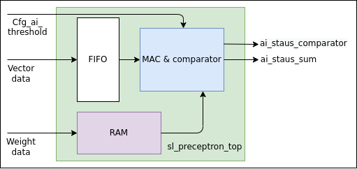
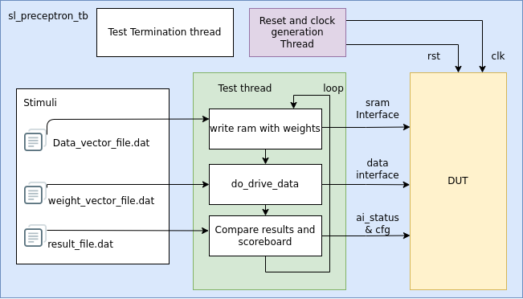

# sl_preceptron
A single layer preceptron has a Multiply and accumulate functionality, which accumulates the results of the dot product of two vectors( data and weight vector of same length) and compares the result to a configured threshold value.  

.  
The Design architecture is briefly described in the diagram, the names doesn't correlate with the file names or module names, but aims to represents the functional abstractions made. The RAM store the weight data, and the data vector is streamed into the design, A 4:1 geared Fifo is used to let the MAC consume the weight and data element at the same rate, and the result are accumulated. The AI status sum and comparator values are updates at the end of processing, when all the vector elements in the vector are consumed. The threshold value is sampled and hold during the start of the processing, or when first vector element is received.  

.   
The Testbench architecture relies on the stimuli file, and supports back to back vectors, where each vector and weight could be streamed in the dut. The result is compared with the expected result from the file.
## Python script
An algorithm of the design is implemented in python3. And will generate the stimuli files for the testbench.
- `python3 sl_preceptron.py` will generate the stimuli files in the same folder. The test bench expects the file generated from this script. This will create the weight file, data file and expected result with threshold data. The length of the vector, the data width etc can be changed in the script.

## Make commands to run.
- `make elaborates` - elaborates the design in vivado.
- `make synth` - runs the synthesis in vivado and generates report.
- `make sim_vivado/sl_preceptron_tb.v` - creates the simulation snapshot, compiles the verilog sources and run the simulation in vivado with waveform. 
All signals at the top level are already added.
- `make  sim/sl_preceptron_tb.fst` 
runs the simulations with icarus Verilog, and dumps the waveform file as sl_preceptron_tb.fst.
You can use GTKwave to view the waveform.
- `gtkwave sim/sl_preceptron_tb.fst &` - picks up the waveform dump.
